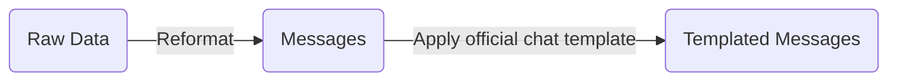

# LlamaFactory reproduction manual

We use [LlamaFactory](https://github.com/hiyouga/LlamaFactory) to **easily** fine-tune models.

## Preparation

```bash
git clone --depth 1 https://github.com/hiyouga/LlamaFactory.git llama-factory
cd llama-factory

uv venv .venv --python 3.13
source .venv/bin/activate
uv pip install -e .
uv pip install -r requirements/metrics.txt
uv pip install tensorboard

# (Optional) Install DeepSpeed to decrease HBM usage
# (add to yaml) deepspeed: examples/deepspeed/ds_z3_config.json
uv pip install -r requirements/deepspeed.txt

# (Optional) Install FA2 to accelerate training and inference
# (add to yaml) flash_attn: fa2
uv pip install packaging psutil ninja
MAX_JOBS=4 uv pip install flash-attn --no-build-isolation -v

# (Optional) Install Liger to accelerate training
# (add to yaml) enable_liger_kernel: true
uv pip install liger-kernel
```

## Data



I recommend apply official chat template on [Messages](https://llamafactory.readthedocs.io/en/latest/getting_started/data_preparation.html#openai) by ourself and serve checkpoints with high performance engines such as vLLM and SGLang.

Then add `template: empty` field to your training config yaml file.

Finally, register the dataset info in `data/dataset_info.json`. For example:

```json
"nemotron_sft_swe_v2_swe_turns": {
  "file_name": "nemotron_sft_swe_v2_swe_turns.json",
  "formatting": "sharegpt",
  "columns": {
    "messages": "conversations",
    "system": "system",
    "tools": "tools"
  }
}
```

## Train

Start training:

```bash
OMP_NUM_THREADS=4 \
  lmf train examples/train_lora/qwen3.5_lora_sft_nemov2_swe.yaml
```

Example [training setup](https://llamafactory.readthedocs.io/en/latest/advanced/arguments.html):

```yaml
### model
model_name_or_path: /path/to/models/Qwen3.5-35B-A3B
trust_remote_code: true

### method
stage: sft
do_train: true
finetuning_type: lora
lora_rank: 32
lora_alpha: 64
lora_dropout: 0.08
lora_target: q_proj,k_proj,v_proj,o_proj,in_proj_qkv,out_proj,gate_proj,up_proj,down_proj
loraplus_lr_ratio: 16.0
deepspeed: examples/deepspeed/ds_z3_config.json

### dataset
dataset: nemotron_sft_swe_v2_agentless
template: empty
enable_thinking: true
cutoff_len: 32768
max_samples: 10000
preprocessing_num_workers: 16
dataloader_num_workers: 4

### output
output_dir: saves/qwen3.5-35b-a3b/sft/lora
logging_steps: 10
save_steps: 100
plot_loss: true
overwrite_output_dir: true
save_only_model: true
report_to: tensorboard

### train
enable_liger_kernel: true
per_device_train_batch_size: 4
gradient_accumulation_steps: 1
learning_rate: 2.0e-5
num_train_epochs: 2.0
lr_scheduler_type: cosine
warmup_ratio: 0.05
bf16: true
ddp_timeout: 180000000
resume_from_checkpoint: null
seed: 42

### eval
val_size: 0.03
per_device_eval_batch_size: 1
eval_strategy: steps
eval_steps: 100
```

## Monitor

We can monitor the loss curve with `tensorboard`:

```bash
tensorboard --logdir saves/qwen3.5-35b-a3b/sft/lora/runs/Jul21_17-43-57_gpu-node01-013
```

## Evaluate

After fine-tuning, we need to evaluate the model.

If you fine-tune model with LoRA method, you need to merge model weitghs between base and LoRA:

```bash
lmf export examples/merge_lora/qwen3.5_lora_sft.yaml
```

Then serve model with inference engine, such as vLLM, SGLang and so on.

Finally, you can call the model API endpoint to evaluate **your** model.
