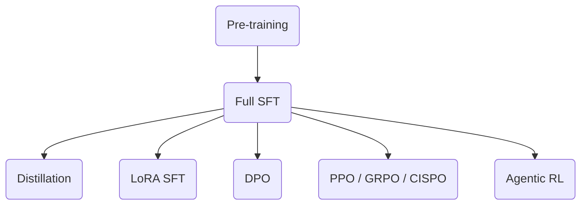

# MiniMind reproduction manual

We use [MiniMind](https://github.com/jingyaogong/minimind) to **easily** develop a large language model from scratch.

## Preparation

### Environment

```bash
git clone --depth 1 https://github.com/Explorer-Dong/minimind.git
cd minimind
uv venv .venv --python 3.12
source .venv/bin/activate
uv pip install -r requirements.txt
```

### Data

```bash
# hf
hf download jingyaogong/minimind_dataset --repo-type=dataset --local-dir ./dataset/ --include "*.jsonl"

# ms
modelscope download --dataset gongjy/minimind_dataset --local_dir ./dataset/ --include "*.jsonl"
```

### Pre-trained models

If you need pre-trained model weights, run:

```bash
# hf
hf download explorer-dong/minimind-v3-out --local-dir ./out

# ms
modelscope download --model dwj601/minimind-v3-out --local_dir ./out
```

### Reward model

```bash
# hf
hf download internlm/internlm2-1_8b-reward --local_dir _models/internlm2-1_8b-reward

# ms
modelscope download --model Shanghai_AI_Laboratory/internlm2-1_8b-reward --local-dir _models/internlm2-1_8b-reward
```

## Train

> [!important]
>
> **Do not update** Swanlab Web panel to adapt to the dependency.



### Pretrain

```bash
cd trainer
OMP_NUM_THREADS=4 \
CUDA_VISIBLE_DEVICES=4,5,6,7 \
torchrun --nproc_per_node 4 train_pretrain.py \
  --max_seq_len 380 \
  --batch_size 128 \
  --data_path ../dataset/pretrain_t2t.jsonl \
  --use_moe 1 \
  --use_wandb \
  --wandb_project minimind
```

### Full SFT

```bash
cd trainer
OMP_NUM_THREADS=4 \
CUDA_VISIBLE_DEVICES=4,5,6,7 \
torchrun --nproc_per_node 4 train_full_sft.py \
  --max_seq_len 768 \
  --batch_size 128 \
  --data_path ../dataset/sft_t2t_mini.jsonl \
  --use_moe 1 \
  --use_wandb \
  --wandb_project minimind
```

### (Optional) Distillation

```bash
cd trainer
OMP_NUM_THREADS=4 \
CUDA_VISIBLE_DEVICES=4,5,6,7 \
torchrun --nproc_per_node 4 train_distillation.py \
  --use_wandb \
  --wandb_project minimind
```

### (Optional) LoRA SFT

```bash
cd trainer
OMP_NUM_THREADS=4 \
CUDA_VISIBLE_DEVICES=4,5,6,7 \
torchrun --nproc_per_node 4 train_lora.py \
  --use_wandb \
  --wandb_project minimind \
  --lora_name lora_exam \
  --data_path ../dataset/lora_exam.jsonl
```

### (Optional) DPO

```bash
cd trainer
OMP_NUM_THREADS=4 \
CUDA_VISIBLE_DEVICES=4,5,6,7 \
torchrun --nproc_per_node 4 train_dpo.py \
  --use_wandb \
  --wandb_project test \
  --epochs 10
```

### (Optional) PPO

```bash
cd trainer
PROTOCOL_BUFFERS_PYTHON_IMPLEMENTATION=python \
OMP_NUM_THREADS=4 \
CUDA_VISIBLE_DEVICES=4,5,6,7 \
torchrun --nproc_per_node 4 train_ppo.py \
  --use_wandb \
  --wandb_project minimind \
  --reward_model_path ../../../_models/internlm2-1_8b-reward
```

### (Optional) GRPO

```bash
cd trainer
PROTOCOL_BUFFERS_PYTHON_IMPLEMENTATION=python \
OMP_NUM_THREADS=4 \
CUDA_VISIBLE_DEVICES=4,5,6,7 \
torchrun --nproc_per_node 4 train_grpo.py \
  --use_wandb \
  --wandb_project minimind \
  --reward_model_path ../../../_models/internlm2-1_8b-reward \
  --loss_type grpo
```

### (Optional) CISPO

```bash
cd trainer
PROTOCOL_BUFFERS_PYTHON_IMPLEMENTATION=python \
OMP_NUM_THREADS=4 \
CUDA_VISIBLE_DEVICES=4,5,6,7 \
torchrun --nproc_per_node 4 train_grpo.py \
  --use_wandb \
  --wandb_project minimind \
  --reward_model_path ../../../_models/internlm2-1_8b-reward \
  --loss_type cispo \
  --save_weight cispo
```

### (Optional) Agentic RL

```bash
cd trainer
PROTOCOL_BUFFERS_PYTHON_IMPLEMENTATION=python \
OMP_NUM_THREADS=4 \
CUDA_VISIBLE_DEVICES=4,5,6,7 \
torchrun --nproc_per_node 4 train_agent.py \
  --use_wandb \
  --wandb_project minimind \
  --batch_size 8 \
  --reward_model_path ../../../_models/internlm2-1_8b-reward
```

## Evaluation

```bash
python eval_llm.py --weight pretrain
```
