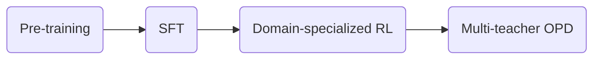
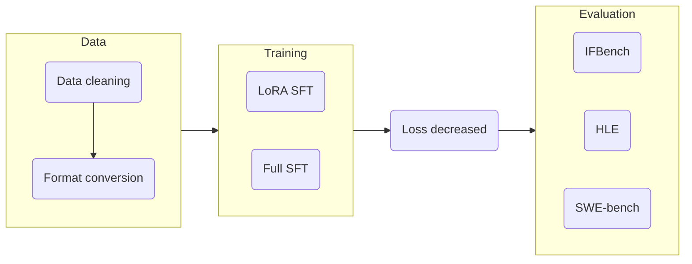

# LLM Training

We train LLM in multiple steps.

## Overview

```mermaid
graph LR
  pre(Pre-training)
  sft(SFT)
  rl(Domain-specialized RL)
  mopd(Multi-teacher OPD)
  pre --> sft --> rl --> mopd
```

## SFT

```mermaid
graph LR
  subgraph data[Data]
    data_clean(Data cleaning)
    data_conv(Format conversion)
    data_clean --> data_conv
  end
  subgraph train[Training]
    direction LR
    lora_sft(LoRA SFT)
    full_sft(Full SFT)
  end
  loss(Loss decreased)
  subgraph eval[Evaluation]
    direction LR
    ifbench(IFBench)
    hle(HLE)
    swe(SWE-bench)
  end
  data --> train --> loss --> eval
```
