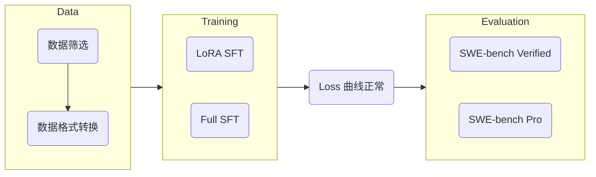

# LLM Training

LLM 训练说明。

## SFT

以 [LlamaFactory](https://github.com/hiyouga/LlamaFactory) 为 SFT 框架。实验流程：



### Data

从开源数据集、自部署 GLM-5.2 / Kimi K3 等模型、产线数据等渠道获取高质量 Coding 与 Code Agent 数据。

接着将筛选出来的数据转换为对应 SFT 框架支持的格式。

以 LlamaFactory 为例：

- 我们可以将数据转换为其支持的 [ShareGPT](https://llamafactory.readthedocs.io/zh-cn/latest/getting_started/data_preparation.html#id22)、[OpenAI Chat Completions](https://llamafactory.readthedocs.io/zh-cn/latest/getting_started/data_preparation.html#openai) 等格式并在运行的配置文件中设置对应的 `template` 字段，例如 `template: qwen3_5`。
- 也可以直接将数据转换为对应模型的 chat_template.jinja 支持的格式，然后弃用 LlamaFactory 的 jinja 文件，即 `template: empty`。

### Training

环境配置：

```bash
# 安装 py3.12 开发工具包（针对 arm）
# 这一步需要在服务器上进行，因为 SSH 登陆时没有 sudo dnf 权限
sudo dnf install -y python3.12-devel

# 安装 uv
curl -LsSf https://astral.sh/uv/install.sh | sh

# 安装 LlamaFactory 及其依赖
git clone --depth 1 https://github.com/hiyouga/LlamaFactory.git
cd LlamaFactory
uv python pin 3.12
uv venv
source .venv/bin/activate
uv pip install -e .
uv pip install -r requirements/metrics.txt
uv pip install tensorboard

# (Optional) 安装 DeepSpeed 减小显存占用
# 若要启用，需要在配置文件中添加 deepspeed: examples/deepspeed/ds_z3_config.json
uv pip install -r requirements/deepspeed.txt

# (Optional) 安装 FA2 加速训推
# 若要启用，需要在配置文件中添加 flash_attn: fa2
uv pip install packaging psutil ninja
MAX_JOBS=4 uv pip install flash-attn --no-build-isolation -v

# (Optional) 安装 Liger 加速训练
# 若要启用，需要在配置文件中添加 enable_liger_kernel: true
uv pip install liger-kernel
```

数据配置：

将转换后的 json 数据存储到 `LlamaFactory/data` 路径下，然后在 `LlamaFactory/data/dataset_info.json` 注册你的数据集。例如：

```json
{
  "nemotron_sft_swe_v2_agentless": {
    "file_name": "nemotron_sft_swe_v2_agentless.json",
    "formatting": "sharegpt",
    "columns": {
      "messages": "conversations"
    }
  },
  "nemotron_sft_swe_v2_swe_turns": {
    "file_name": "nemotron_sft_swe_v2_swe_turns.json",
    "formatting": "sharegpt",
    "columns": {
      "messages": "conversations",
      "system": "system",
      "tools": "tools"
    }
  }
}
```

训练配置：

示例配置如下，参数含义详见 [LlamaFactory Docs](https://llamafactory.readthedocs.io/zh-cn/latest/advanced/arguments.html)，这里给一些基本的解释：

- 如果 `enable_thinking: false`，需要给 `template` 配置项添加 `_nothink` 后缀
- 参考 [statis_nemotron_v2](../scripts/statis_nemotron_v2.py) 的实现统计数据集的数据分布，选择合适的 `cutoff_len`

```bash
### model
model_name_or_path: /cpfs01/llm_team/models/Qwen3.5-35B-A3B
trust_remote_code: true

### method
stage: sft
do_train: true
finetuning_type: lora
lora_rank: 32
lora_alpha: 64
lora_dropout: 0.08
lora_target: q_proj,k_proj,v_proj,o_proj,in_proj_qkv,out_proj,gate_proj,up_proj,down_proj
loraplus_lr_ratio: 16.0
deepspeed: examples/deepspeed/ds_z3_config.json

### dataset
dataset: nemotron_sft_swe_v2_agentless
template: qwen3_5
enable_thinking: true
cutoff_len: 32768
max_samples: 10000
preprocessing_num_workers: 16
dataloader_num_workers: 4

### output
output_dir: saves/qwen3.5-35b-a3b/sft/lora-0723-agentless
logging_steps: 10
save_steps: 100
plot_loss: true
overwrite_output_dir: true
save_only_model: true
report_to: tensorboard

### train
enable_liger_kernel: true
per_device_train_batch_size: 4
gradient_accumulation_steps: 1
learning_rate: 2.0e-5
num_train_epochs: 2.0
lr_scheduler_type: cosine
warmup_ratio: 0.05
bf16: true
ddp_timeout: 180000000
resume_from_checkpoint: null
seed: 42

### eval
val_size: 0.03
per_device_eval_batch_size: 1
eval_strategy: steps
eval_steps: 100
```

启动训练任务：

```bash
cd LlamaFactory
export HF_HOME=../.cache/huggingface

# 在 Agentless 数据上微调
OMP_NUM_THREADS=4 lmf train examples/train_lora/qwen3.5_lora_sft_nemov2_agentless.yaml

# 在 SWE 数据上微调
OMP_NUM_THREADS=4 lmf train examples/train_lora/qwen3.5_lora_sft_nemov2_swe.yaml

# 在 SciCode trajectories (GLM-5.2) 数据上微调
OMP_NUM_THREADS=4 lmf train examples/train_lora/qwen3.5_lora_sft_scicode-trajectories.yaml
```

观察 Loss 曲线：

```bash
tensorboard --logdir saves/qwen3.5-35b-a3b/sft/lora/runs/Jul21_17-43-57_gpu-node01-013
```

### Evaluation

如果训练和验证的 Loss 曲线的变化趋势在预期范围内，就可以考虑使用评分基准进一步验证 SFT 的有效性。

将 Base 权重和 LoRA 权重合并：

```bash
lmf export examples/merge_lora/qwen3.5_lora_sft.yaml
```

接着使用推理引擎部署合并后的模型，详情见 [LLM Serving](../../serving/README.md) 的说明。

然后将本地启动的端点接入各种评测框架即可。

## RL

配置 [VERL](https://verl.readthedocs.io/en/latest/index.html) 开发框架：

```bash
# 拉取基础开发环境
docker pull verlai/verl:sgl0512.dev4

# 挂载数据并启动容器
docker run -d \
  --name verl-dev \
  --gpus '"device=4,5,6,7"' \
  --network host \
  --ipc=host \
  --shm-size=32g \
  -v /path/to/models:/models \
  -v /workspace:/workspace \
  -w /workspace
  verlai/verl:sgl0512.dev4 \
  sleep infinity

# 进入开发容器
docker exec -it verl-dev bash

# 安装 VERL 源码
git clone https://github.com/verl-project/verl && cd verl
# Optional: 根据实际项目回退到指定 VERL 版本
# git reset <commit_id>
pip3 install --no-deps -e .

# 退出开发容器
exit
```
